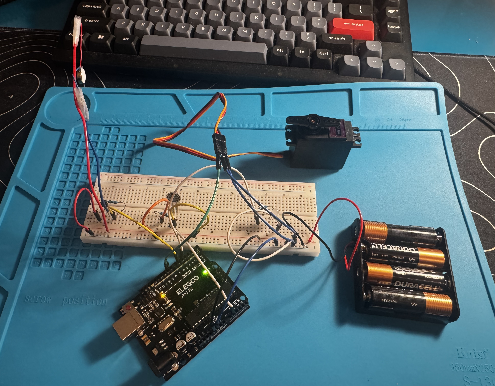

# EMG-Controlled Prosthetic Hand with Haptic Feedback
3D-printed prosthetic hand controlled by muscle signals, with force feedback so the user can feel what they're gripping. Built for people with below-elbow limb differences.

**Status: Phase 1 in progress - haptic feedback prototype running, MyoWare EMG sensor on its way.**

---

## Demo

[Week 1 - FSR, servo, LED, and haptic motor all running together](https://youtu.be/Y5S91mNR1Is)

---

## The Idea
Cheap open-source prosthetic hands already exist. The problem is they give you zero sensory feedback, meaning you have to watch your hand constantly because you can't feel whether you're gripping too hard or too soft. Commercial hands that solve this cost $10,000 to $70,000.

This project adds haptic feedback to a low-cost design using force-sensitive resistors in the fingertips and a small vibration motor on the forearm sleeve. When the hand grips something, the user feels a buzz proportional to grip force. The whole addition costs under $10 in extra parts.

The research question: does haptic feedback actually improve grip performance compared to without it? I'll be running formal tests and posting the data here.

---

## Hardware (planned)
- MyoWare 2.0 EMG sensors x2
- Arduino Uno
- MG996R servo motors x4
- Force sensitive resistors x4
- Coin vibration motors x6
- 3D printed hand based on the e-NABLE Phoenix design, modified in Fusion 360

Total spent so far: around $175.

---

## Status
Started February 22, 2026. Updating as the build progresses.

---

## Background
I'm a high school junior interested in mechanical engineering. I started this project because the haptic feedback gap in low-cost prosthetics seemed like a real problem worth trying to solve, and something actually achievable without a lab. Documenting everything here as it happens.
